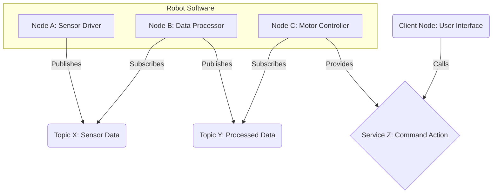
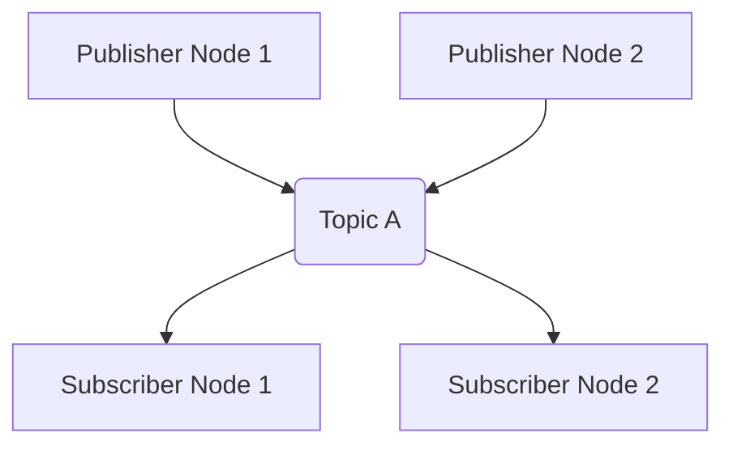

# ROS 2 Architecture

The Robot Operating System 2 (ROS 2) is a flexible framework for writing robot software. It is a collection of tools, libraries, and conventions that aim to simplify the task of creating complex and robust robot behavior across a wide variety of robotic platforms. Unlike its predecessor, ROS 1, ROS 2 was re-architected with an emphasis on real-time control, multi-robot systems, and embedded platforms.

## Core Concepts

At the heart of ROS 2 are several interconnected concepts that facilitate modular and distributed robot applications.

### 1. Nodes: The Computational Units

In ROS 2, a **Node** is an executable process that performs computations. Nodes are designed to be modular, meaning each node is responsible for a single, well-defined task. For example, one node might be responsible for reading data from a laser scanner, another for processing that data to detect obstacles, and yet another for sending commands to the robot's motors.

-   **Modularity**: Breaking down a robot's functionality into smaller, independent nodes makes the system easier to understand, develop, debug, and maintain.
-   **Distribution**: Nodes can run on different machines or different processes on the same machine, communicating over a network. This allows for distributed computing and leverages the power of multiple processors or even multiple robots.

### 2. Topics: Asynchronous Data Streaming

**Topics** are the primary mechanism for asynchronous, one-way communication in ROS 2. Nodes publish messages to topics, and other nodes subscribe to those topics to receive the messages. This is a publish-subscribe model, where publishers send data without knowing or caring if there are any subscribers, and subscribers receive data from any publisher on a given topic.

-   **Publishers**: Nodes that send data to a topic.
-   **Subscribers**: Nodes that receive data from a topic.
-   **Messages**: Data structures that are sent over topics. Each topic has a defined message type, ensuring that all data transmitted on that topic conforms to a specific structure.

This model is ideal for streaming data, such as sensor readings (e.g., camera images, LiDAR scans, IMU data) or continuous motor commands.

### 3. Services: Synchronous Request/Reply

**Services** in ROS 2 provide a synchronous request/reply communication mechanism. Unlike topics, services are used for discrete, blocking operations where a client node sends a request to a service server node and waits for a response.

-   **Service Server**: A node that offers a service. When it receives a request, it performs the requested operation and sends back a response.
-   **Service Client**: A node that sends a request to a service server and blocks until it receives a response.
-   **Service Definition**: Specifies the structure of the request and response messages for a service.

Services are typically used for tasks that require a specific action to be performed and a result to be returned, such as querying a robot's current state, triggering a specific movement sequence, or changing a robot's configuration.

### 4. Parameters: Dynamic Configuration

**Parameters** allow nodes to expose configurable values. These can be used to dynamically adjust a node's behavior without recompiling the code. For example, a navigation node might expose parameters for controlling its speed or obstacle avoidance thresholds. Parameters can be set and retrieved by other nodes or by command-line tools.

## Communication Infrastructure

ROS 2's communication is built upon a **Data Distribution Service (DDS)** implementation. DDS is an open international standard for publish-subscribe communication for real-time systems. It handles the low-level details of networking, discovery, serialization, and deserialization of messages, allowing ROS 2 developers to focus on application logic.

The use of DDS provides several key advantages:

-   **Decentralization**: No central master node is required, which enhances robustness and reduces single points of failure.
-   **Discovery**: Nodes can automatically discover each other on the network without explicit configuration.
-   **Quality of Service (QoS)**: DDS provides a rich set of QoS policies that allow developers to fine-tune communication characteristics, such as reliability, latency, and data persistence, to meet specific application requirements.

## Summary

The architectural components of ROS 2—Nodes, Topics, Services, and Parameters—together with the underlying DDS communication infrastructure, provide a powerful and flexible framework for building complex robotic systems. Understanding these concepts is fundamental to developing robust and efficient ROS 2 applications.
